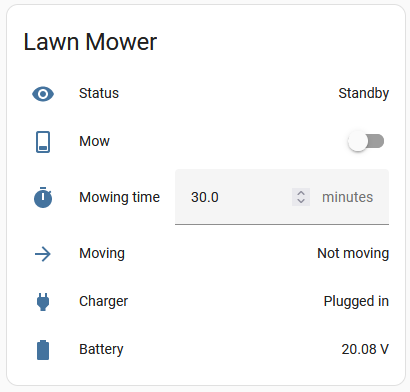
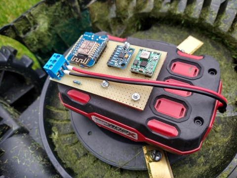
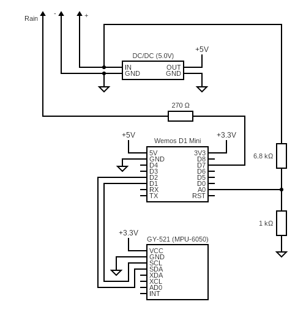
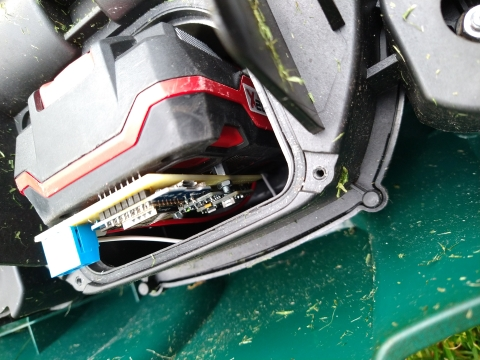

# HA_Mower
Connect a non-smart robot lawn mower to Home Assistant, using ESPHome.

This project was made for my own **Parkside PMRA 20-Li A1** mower, but it might just work with your mower as well.\
From Home Assistant (or any system supporting ESPHome) you can keep track if your mower's status, command it to mow and set the mowing time.\

This project hooks into the (analog) rain sensor of the mower. It will also detect whether the mower is moving and whether the charger is connected.\
While mowing, timekeeping is performed on the mower itself, this ensures that the mower always returns when the time is up; even if WiFi is out of range or when Home Assistant is down.

The hardware consists of an ESP8266 board, an accelerometer board, a DC/DC converter and 3 resistors; assembled toghether on a piece of perfboard.\
\
 

I have mounted the hardware onto the battery pack, and soldered it directly to the battery poles (inside the battery housing).\
In the robot, one (single) wire needs to be spliced into a rain sensor wire. That is all the hardware needed.\
The mower needs to be configured to mow 24 hours per day. Also the mower needs to be configure to stop mowing if rain is detected and to resume as soon as the rain is over. _Consult the manual of your mower with regards to configuration._\

When the is hardware ready, build and upload the provided ESPHome configuration to your ESP board. Your mower should now be ready for action. Make sure you have adequate WiFi coverage on your lawn, or at least to the dock.

If you have a different mower then some adjustments to the ESPHome configuration may be needed. If you need help, my time is limited, but I will try to help.\
I have found the people at [Home Assistant community](https://community.home-assistant.io/ "Hello ;)") very responsive and helpful.

